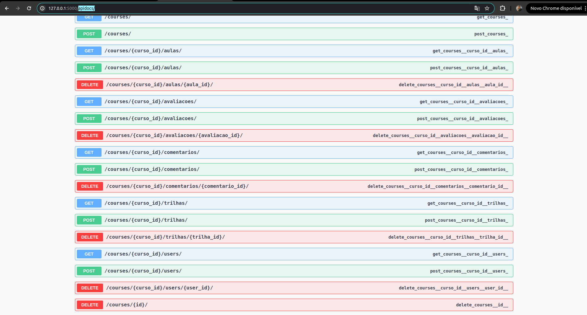

# Api para gerenciar cursos e trilhas

## Planejamento Geral:


- Sistema de controle de usuários
    - Cadastro, Login e Logout (use JWT)
- Sistema de controle de cursos
    - Trihas de aprendizado, cursos, aulas, comentários, avaliações
    - As trilhas de aprendizado podem conter vários cursos
    - Um curso pode estar em mais de uma trilha
    - CRUD de todas as entidades
  
### Ideias principais do projeto:

- Separei o Projeto por entidades, seguindo uma mistura de DDD e Arquitetura Hexagonal
- As Apis deve ser o Padrão REST
- As Apis devem possuir testes e documentação em swwaguer
- Usar um Backend em Flask de acordo com os requisitos
- Usar a ORM do sqlalchermy quanto consultas diretas no DB
- Usar o Postgres como SQL database
- Ter um banco de cache (Redis) para relatórios e notificações, sendo escrito pelo back e lido pelo Front (futuramente).

**O front mandaria uma requisição pesada para o back -> eu separaria essa requsição em uma tread paralela -> processaria esses dados -> salvaria no banco de cache -> se houvesse alteração nos dados e outro relatório fosse requirido, eu limparia o cache e salvaria lá de novo.**


## Como rodar o projeto passo a passo:

- Primeiro, faça o clone do projeto 
```bash
git clone url_do_projeto
```
- Tenha o Postgres 16 instalado na sua maquina, caso não tenha, pode baixa-lo aqui: [Download Postgres](https://www.postgresql.org/download/linux/debian/)
- Apos instalar o Postgres, crie um banco de dados vazio, algo como "courses_system" 
- Crie um ambiente virtual na pasta preferida ou com pyenv e o ative.
- Instale as dependencias na raiz do projeto:
- - Vai ter um arquivo `requirements.txt`, basta abrir um terminal e digitar:

````bash
pip install -r requirements.txt
````
(Isso vai instalar todas as nossas dependencias.)

(_Certifique-se que nada esta rodando na porta 5000, 5435_)
 
- Crie um arquivo .env na raiz do projeto, nele voce vai setar variaveis do DB (Segue exemplo na raiz do projeto: .env-example).
- Depois de criar o DB e setar as variaveis de conexão em .env.
- - Na pasta apps/utils/ do projeto, rode o arquivo "create_tables_db.py" de criação das tabelas pelo o pycharm ou terminal:
````bash
python create_tables_db.py
````

- - Verifique se as tabelas foram criadas no seu banco de dados.
- Agora, volte para a pasta apps/ e execute a aplicação pelo o pycharm(recomendado) ou pelo o terminal:

````bash
python application.py
````

#### Açoes da API:
- Foi feita toda a documentação da api usando swagguer, onde vc encontra no endpoint: [hhtp://localhost:5000/apidocs//]() .
#### Como rodar os testes:
- Na raiz do projeto, execute:
````bash
pytest -v 
````
#### Pontos Fracos do projeto:
- Não deu tempo de implementar o banco de cache e uma paginação, pois havia mto endpoits
- - como seria:
- - Após clicar em gerar um relatório, o back receberia essa task, processaria em background e guardaria no cache (redis)
- - (guardaria filtros específicos em variaveis no redis) 
- - se solicitado outro filtro, faria a mesma coisa. Solicitado o mesmo, pegaria do cache e nao faria requisição para o back.
- - houve alterações na Trilha/Curso/Aula? resetaria o banco de cache e reiniciaria o fluxo.
- Não há uma cobertura ampla de testes

#### Pontos Fortes:
- Bastante endpoints
- Boa documentação dos endpoints, onde é possivel fazer boas integrações- [hhtp://localhost:5000/swwager/]()
- testes unitários
- Boa estruturação do projeto
- Sistema separado por entidades, garantido uma melhor escabilidade.
- e mais!

#### Dúvidas? 
[Meu Linkedin](https://www.linkedin.com/in/ryan-victor-alves/)
